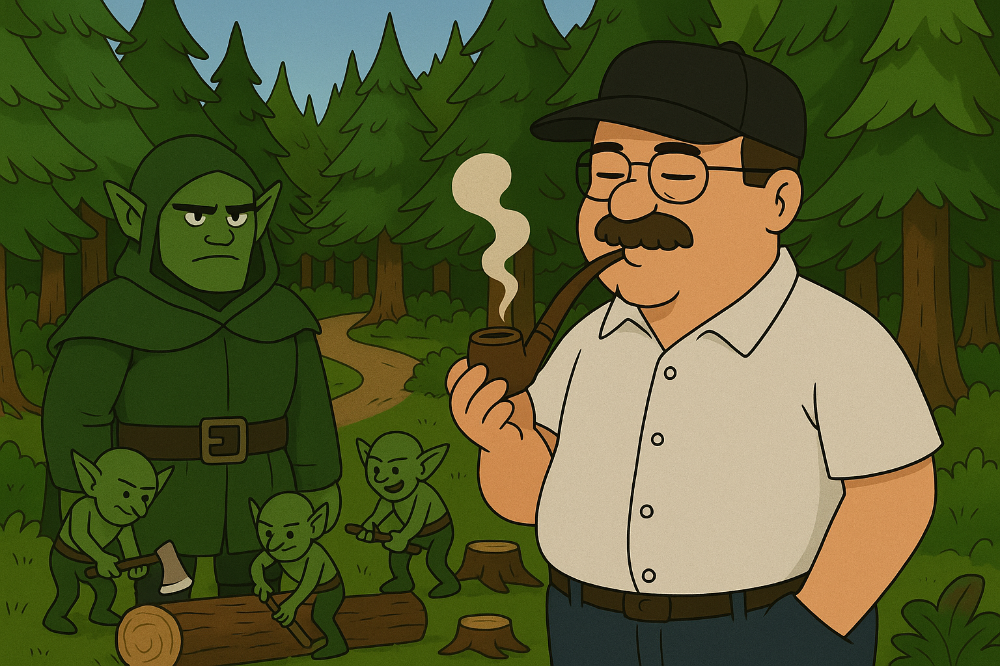
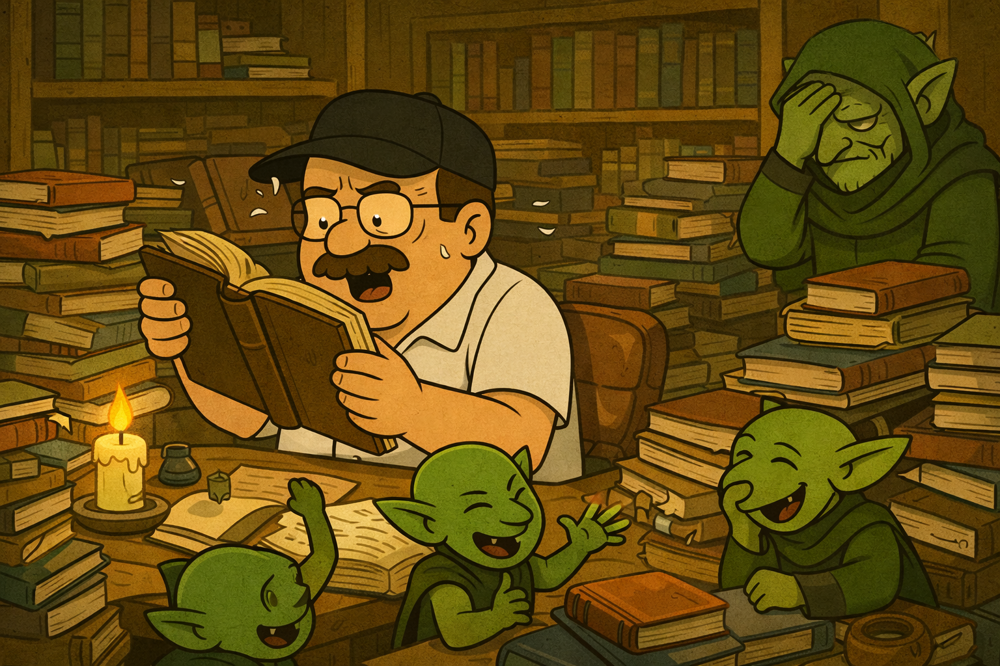
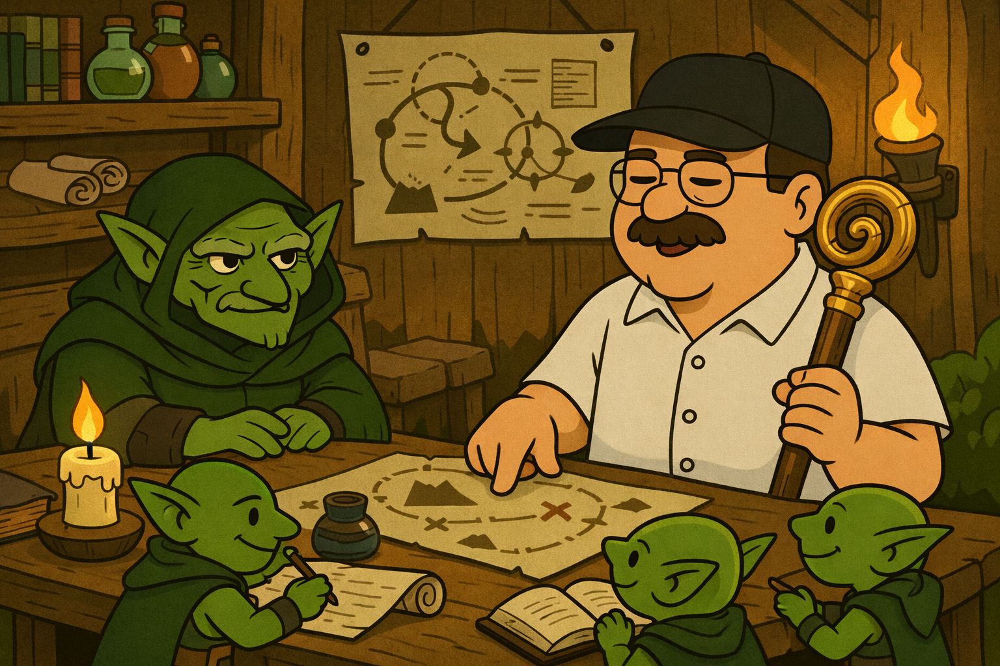
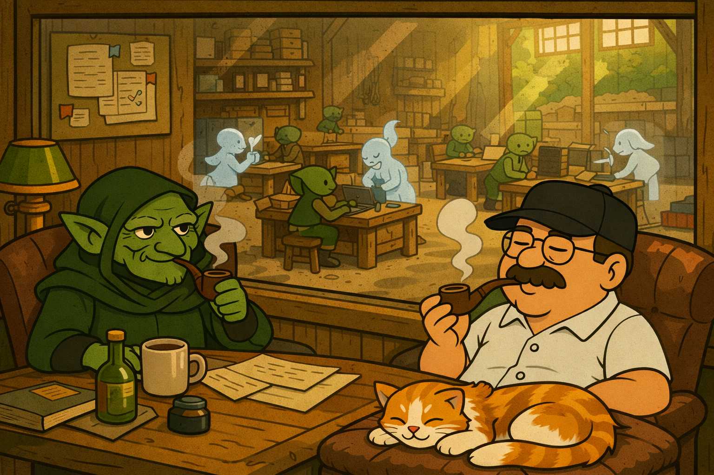

<h1 align="center">✨🌲🏭 Orc - The Forest Factory 🏭🌲✨</h1>

<p align="center">
<br>
The factory runs on SQLite and git worktrees (and Anthropic tokens 😅).
</p>

Orc is a tmux-based IDE for structured AI-assisted work.

It leans into Claude Code's features wherever possible and provides a "batteries-included" experience for the busy engineer:

- Provisions isolated git worktrees on demand
- Tracks everything in a persistent ledger
- Drives shipments from messy ideation to clarity
- Integrates with 🆕🤑 Claude Teams 🤑🆕 for long-running and parallel task execution

## 🎭 The Cast

> See [docs/schema.md](docs/schema.md) for the full glossary.

### Where

**🏭 Orc** is the factory itself — the CLI and its SQLite ledger. It tracks commissions, shipments, tasks, and notes. It provisions workbenches, deploys skills, and remembers everything across sessions. Orc is the source of truth.

**🔨 Workbenches** are where the work happens. Each one is a git worktree — an isolated copy of the repository where a goblin and its imps can make changes without disturbing other workbenches.

**🏗️ Workshops** are collections of workbenches organized around a project or theme. One commission might have several workshops, each focused on different areas of work.

### Who

**👺 Goblins** are coordinators — the human's long-running workbench pane. A goblin manages the big picture: planning shipments, synthesizing ideas, and keeping the ledger honest. Think of them as your foreman on the factory floor.

**👹 Imps** are disposable workers — spawned by Claude Teams to execute tasks in parallel. Give them a task, they hammer it out and report back. Swarm a shipment with three imps and watch the work fly.

### What

**📜 Commissions** are the grand undertakings that give work context and purpose.

**🚢 Shipments** are bundles of tasks moving through the system — the primary unit of work. They progress through `draft → ready → in-progress → closed`.

**📋 Tasks** are the atomic units of work within a shipment. Each task is a specific thing to build, fix, or document.

## 🚀 Getting Started

```bash
git clone git@github.com:looneym/orc.git ~/src/orc
cd ~/src/orc
make bootstrap
```

Then run `orc hello` for an interactive walkthrough that creates your first commission, workshop, and shipment.

Once you're set up, `orc summary` shows the shape of your work:

```
Workshop WORK-003 (Backend Platform)
|
├── 👺 auth-bench [ml/auth-bench] → SHIP-042
└── 👺 session-bench [ml/session-bench] → SHIP-043

COMM-003 [focused by ✨ you ✨] - Build the auth system
│
├── SHIP-042 [in-progress] [focused by you] - OAuth2 integration (2/5 done, 3 notes)
│   ├── NOTE-301 [spec] - Summary: OAuth2 integration
│   ├── TASK-101 ✅ Design token schema
│   ├── TASK-102 ✅ Implement token store
│   ├── TASK-103 🔨 Add refresh flow
│   ├── TASK-104 📦 Write middleware
│   └── TASK-105 📦 Update docs
│
└── SHIP-043 [ready] [focused by session-bench@BENCH-009] - Session management (0/3 done, 1 note)
    ├── NOTE-315 [spec] - Summary: Session management
    ├── TASK-106 📦 Design session model
    ├── TASK-107 📦 Implement Redis adapter
    └── TASK-108 📦 Add logout endpoint
```

> See [docs/getting-started.md](docs/getting-started.md) for the full setup guide.

## 🚂 The Engine

Orc turns messy exploration into structured execution. A shipment moves through four phases:

### 💡 Ideate

```
/ship-new "OAuth2 integration"
```

Share scattered ideas, ask questions, raise concerns. Orc captures everything as notes in the shipment ledger. Nothing is lost.

```
SHIP-042 [draft] - OAuth2 integration (0/0 done, 9 notes)
│
├── NOTE-301 [idea] - Use JWT with short-lived access tokens
├── NOTE-302 [idea] - Consider opaque tokens for revocation
├── NOTE-303 [question] - Do we need refresh token rotation?
├── NOTE-304 [finding] - Current session store won't scale past 10k concurrent
├── NOTE-305 [concern] - Token revocation latency if we go stateless
├── NOTE-306 [decision] - Redis for token store (not Postgres)
├── NOTE-307 [idea] - Middleware should be pluggable per-route
├── NOTE-308 [question] - What scopes do we need for v1?
└── NOTE-309 [concern] - Third-party OAuth providers add surface area
```

### 🔮 Synthesise

<p align="center">
<br>
<em>When the notes pile up, themes emerge</em>
</p>

```
/ship-synthesize

Themes identified:

  1. Token storage strategy (4 notes)
     NOTE-301, NOTE-305, NOTE-308, NOTE-312

  2. Refresh flow edge cases (3 notes)
     NOTE-303, NOTE-306, NOTE-310

  3. Middleware design (2 notes)
     NOTE-304, NOTE-311

Select theme to explore (1-3), or [a]ll:
```

An interview walks through each theme — resolving open questions, recording decisions, discarding what's stale. What comes out the other side is a clean summary note.

### 🗺️ Plan

You are a very busy and important person who can't be expected to pay attention to every little detail. Orc uses the [C4 model](https://c4model.com/) to help you reason about your codebase while mostly thinking about `containers` and `components`, leaving imps to worry about `code` (mostly). This approach rewards clear planning, and works well with clear coding practices, automated tests, and checkpointing.

<p align="center">
<br>
<em>Pressure-test your understanding and generate tasks</em>
</p>

```
/ship-plan

## Phase 2: Specification Gaps

[Question 1/3]

The summary says "support refresh tokens" but doesn't specify
what happens when a refresh token is revoked mid-session.

  1. Invalidate immediately (recommended)
  2. Allow grace period
  3. Skip — let imp decide
  4. Discuss

Proposed tasks:

  TASK-201: Implement token store     Components: internal/auth/
  TASK-202: Add refresh flow          Components: internal/auth/, internal/api/
  TASK-203: Write auth middleware      Components: internal/middleware/
  TASK-204: Update API docs           Components: docs/

Create these tasks? [y/n/edit]
```

### 👹 Run

<p align="center">
<br>
<em>Delegate to the imps</em>
</p>

```
/ship-run

Workers launched:
  imp-alpha:   TASK-201, TASK-202 (2 tasks)
  imp-bravo:   TASK-203, TASK-204 (2 tasks)
```

Imps fan out across parallel streams, each working through their assigned tasks. The goblin monitors progress. `orc summary` shows it all.

> See [docs/common-workflows.md](docs/common-workflows.md) for detailed workflow patterns.

## 📚 Learn More

- [Getting Started](docs/getting-started.md) — Setup and first-run guide
- [Common Workflows](docs/common-workflows.md) — Shipment and task lifecycles
- [Schema & Glossary](docs/schema.md) — Complete terminology
- [Architecture](docs/architecture.md) — Codebase structure (C4 model)
