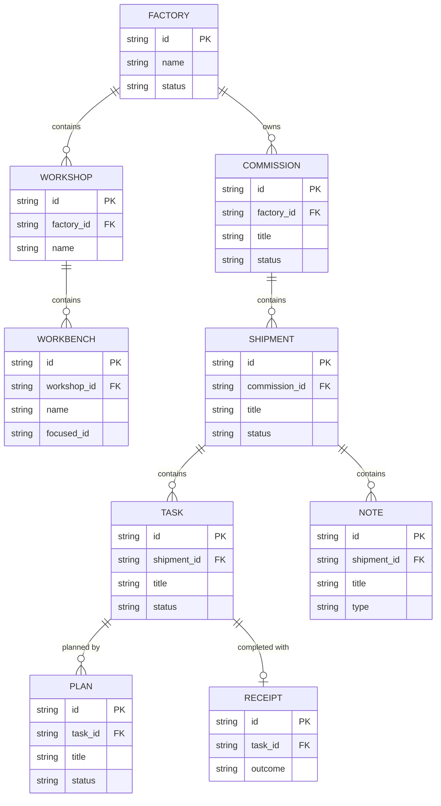

# ORC Architecture

**Updated:** 2026-02-03

---

## C4 Model Overview

This document uses C4 model terminology for architectural description:

| Level | Scope | Documented Here |
|-------|-------|-----------------|
| C1: System Context | External systems, actors | Yes |
| C2: Container | Deployable/distinct units | Yes |
| C3: Component | Modules within containers | Yes |
| C4: Code | Files, functions, classes | No (too granular) |

---

## C1: System Context

ORC (Orchestrator) is a commission coordination system for managing complex, multi-repository software development work. It coordinates between human operators and Claude AI agents.

**External Actors:**
- **El Presidente** - Human operator who drives commissions
- **Claude Code** - AI agent runtime that executes skills
- **Git** - Version control (worktrees for isolation)
- **TMux** - Terminal multiplexer for agent sessions

---

## C2: Containers

| Container | Location | Description |
|-----------|----------|-------------|
| CLI | cmd/orc/, internal/ | ORC command-line tool binary |
| Database | internal/db/, schema/ | SQLite ledger with Atlas migrations |
| Skills | glue/skills/ | Claude Code skill definitions |
| Hooks | glue/hooks/ | Git and Claude Code hooks |
| Config | .orc/ | Runtime configuration per workspace |
| Documentation | *.md, docs/ | Project and workflow documentation |

---

## C3: Components

### CLI (cmd/orc/, internal/)

| Component | Location | Description |
|-----------|----------|-------------|
| Entry | cmd/orc/ | CLI entry and command registration |
| App | internal/app/ | Application services and use cases |
| CLI | internal/cli/ | Cobra command implementations |
| Core | internal/core/ | Domain entities and logic |
| Models | internal/models/ | Data models |
| Adapters | internal/adapters/ | Interface adapters |
| Ports | internal/ports/ | Port interfaces |
| DB | internal/db/ | Database access layer |
| TMux | internal/tmux/ | TMux integration |

### Skills (glue/skills/)

**Shipment Workflow:**
| Skill | Description |
|-------|-------------|
| ship-new | Create new shipments |
| ship-synthesize | Knowledge compaction → summary note |
| ship-plan | C2/C3 engineering review → tasks |
| ship-queue | View shipyard queue |
| ship-complete | Complete shipments |
| ship-deploy | Deploy shipments |
| ship-freshness | Rebase and validate tasks/notes |
| release | Cut semantic version releases |

**IMP Workflow:**
| Skill | Description |
|-------|-------------|
| imp-start | Begin IMP work on shipment |
| imp-plan-create | Create C4 implementation plans |
| imp-plan-submit | Submit plans for review |
| imp-implement | Show approved plan for coding phase |
| imp-auto | Toggle auto mode |
| imp-rec | Create receipts |
| imp-escalate | Escalate to gatehouse |
| imp-nudge | Manual re-propulsion check |
| imp-poll | Check shipyard queue for work |
| imp-respawn | Respawn tmux pane for clean context |

**Goblin Workflow:**
| Skill | Description |
|-------|-------------|
| goblin-escalation-receive | Handle incoming escalations |

**Setup & Admin:**
| Skill | Description |
|-------|-------------|
| orc-commission | Create new commissions |
| orc-workshop | Create new workshops |
| orc-workshop-archive | Archive workshops |
| orc-workshop-templates | Manage workshop templates |
| orc-workbench | Create new workbenches |
| orc-repo | Add repositories to config |

**Utilities:**
| Skill | Description |
|-------|-------------|
| orc-first-run | Interactive first-run walkthrough |
| orc-interview | Reusable interview primitive |
| orc-architecture | Maintain ARCHITECTURE.md |
| orc-help | Orientation to ORC skills |
| docs-doctor | Validate documentation against code |
| orc-ping | Verify ORC is working |
| orc-self-test | Integration self-testing |

**Exploration:**
| Skill | Description |
|-------|-------------|
| orc-ideate | Rapid idea capture |
| orc-journal | Capture observations and learnings |

### Database (internal/db/, schema/)

| Component | Description |
|-----------|-------------|
| schema.sql | Database schema definition |
| migrations/ | Atlas migration files |

---

## Skill Workflow

```
/ship-synthesize → Summary note (knowledge compaction)
       ↓
/ship-plan → Tasks (C2/C3 engineering review)
       ↓
/imp-plan-create → Plans (C4 file-level detail)
       ↓
/imp-plan-submit → Plan approval
       ↓
/imp-implement → Show plan, begin coding
       ↓
Implementation → Code
       ↓
/imp-rec → Verify, receipt, chain to next task
```

**Zoom Level Ownership:**
- C2/C3 (containers, components): ship-plan, orc-architecture
- C4 (files, functions): imp-plan-create

---

## Core Hierarchy

```
Commission (coordination scope)
├── Shipments (execution containers with lifecycle)
│   ├── Notes (ideas, questions, decisions, specs)
│   └── Tasks (atomic units of work)
└── Workbenches (git worktrees with IMP agents)
```

**Design Principles:**
- **Simplicity Over Hierarchy** - Flat structure where possible
- **Commission-Centric Organization** - Commission is the coordination boundary
- **Database as Source of Truth** - Single authoritative data source (SQLite)
- **Skill-Driven Workflows** - Claude skills encode process knowledge

---

## Core Features

### 1. Commission Management
- **Commission**: Top-level coordination scope (e.g., "Sidekiq Deprecation", "Auth Refactor")
- Owns multiple Workshops with Workbenches and Shipments
- Each commission can have a dedicated TMux session with IMP agents in workbenches
- Support for both ORC-development commissions and application-code commissions

### 2. Shipment & Task System
**Shipment-based workflow:**
- Shipments represent units of work with exploration → implementation lifecycle
- Tasks belong to shipments and represent specific implementation work
- Status lifecycle: draft → exploring → specced → tasked → in_progress → complete
- Type categorization: research, implementation, fix, documentation, maintenance
- Pinnable items for visibility
- Emoji-rich CLI output for quick status scanning

**Key Commands:**
```bash
orc shipment create "Title" --commission COMM-XXX
orc task create "Task description" --shipment SHIP-XXX
orc task claim TASK-XXX
orc task complete TASK-XXX
orc summary                    # Hierarchical view with pinned items
```

### 3. Workbench Management (Git Worktree Integration)
**Workbench**: An isolated git worktree for a workshop, registered in the database

- Workbenches belong to workshops, assigned shipments for implementation
- Multiple workbenches per workshop (e.g., backend, frontend, api repos)
- Tasks are assigned to workbenches (via assigned_workbench_id)
- IMP (Implementation) = Workbench (conceptual equivalence, no separate entity)

**Key Commands:**
```bash
orc workbench create [name] --repos main-app --workshop WORK-001
orc workbench list [--workshop WORK-XXX]
orc workbench show BENCH-XXX
orc workbench rename BENCH-XXX new-name
```

**Workbench Features:**
- Creates git worktree automatically
- Writes config.json to .orc/ subdirectory (reference only)
- Writes .orc-commission marker for context detection
- Opens in TMux with 3-pane IMP layout: vim | claude | shell

### 4. Agent Types (IMP, Goblin, Watchdog)
**Concept**: Place-based actor model with three agent types

**Agent Types:**
- **IMP (Implementation Agent)**: Works within a workbench (BENCH-XXX) on assigned shipments/tasks
- **Goblin**: Workshop gatekeeper (GATE-XXX) that reviews plans and handles escalations
- **Watchdog**: IMP monitor (WATCH-XXX) that tracks progress

**Architecture Principles:**
- Identity tied to place (place_id in config)
- IMPs operate within workbench boundaries
- Goblins coordinate via escalation handling
- Coordination via shared summary bus

**Communication:**
- Escalations for judgment calls
- Tasks for implementation work

### 5. Context Preservation & Handoffs
**orc prime & handoff Integration:**

Session boundaries are preserved through:
- **Handoffs**: Narrative summaries stored in SQLite database
- **orc prime**: Injects context at session start (commission, epic, tasks, recent handoff)
- **orc handoff create**: Captures session work, decisions, discoveries at session end

**Key Features:**
- Cross-session memory preservation via handoff narratives
- New Claude sessions start with full historical context
- Zero "cold start" problem
- Handoffs searchable via CLI (`orc handoff list`, `orc handoff show`)

### 6. TMux Integration
**One TMux session per commission:**
```
TMux Session: "Workshop Name" (orc-WORK-XXX)
├── Window 0: Goblin (coordination)
├── Window 1: IMP in BENCH-001 (vim | claude | shell)
└── Window 2: IMP in BENCH-002 (vim | claude | shell)
```

**Features:**
- Workbench directories contain `.orc-config.json` for context detection
- All panes CD into workbench directory
- Easy context switching between coordination and implementation

**Agent Starting Pattern:**
ORC uses **direct prompt injection** when starting Claude agents in TMux:

```bash
claude "Run `orc prime`"
```

This pattern replaces SessionStart hooks (which are broken in Claude Code v2.1.7). When agents start:
1. TMux sends the command with prompt: `claude "Run \`orc prime\`"`
2. Claude receives the prompt and executes `orc prime`
3. `orc prime` detects the agent's location (workbench/commission/global) and provides appropriate context
4. Agent begins work with full context immediately

**Benefits:**
- Reliable context injection (not dependent on broken hooks)
- Immediate agent activation
- Clear, explicit agent instructions
- Easier debugging (command visible in TMux history)
- Works consistently across all agent types (IMPs, ORC)

---

## Technology Stack

### Primary Technologies
- **Language**: Go (CLI binary)
- **Database**: SQLite (single source of truth for all operational data)
- **Version Control**: Git (with worktree integration)
- **Session Management**: TMux
- **AI Integration**: Claude API (via Claude Code CLI)

### Database Schema (SQLite)

**Core Tables:**
- `commissions` - Top-level coordination scopes
- `work_orders` - Tasks with status, type, parent_id, assigned_workbench_id, pinned flag
- `workbenches` - Git worktrees registered to commissions
- `handoffs` - Session handoff narratives for context preservation

**Removed Tables (simplified in 2.0):**
- ~~`operations`~~ - Removed (too rigid, use work_order.type instead)
- ~~`expeditions`~~ - Removed (1:1:1 mapping didn't match workflow)
- ~~`dependencies`~~ - Not implemented yet (can add later if needed)

**Key Fields:**
- `work_orders.status`: ready | design | implement | deploy | blocked | paused | complete
- `work_orders.type`: research | implementation | fix | documentation | maintenance
- `work_orders.parent_id`: Optional epic/parent reference
- `work_orders.assigned_workbench_id`: Workbench assignment
- `work_orders.pinned`: Boolean for visibility

### Entity Relationships (Core)



**Core Hierarchy:**
- **Factory** → Workshop → Workbench (infrastructure)
- **Commission** → Shipment → Task (work tracking)
- **Task** → Plan → Receipt (execution flow)

See `internal/db/schema.sql` for the complete 27-table schema including monitoring (Kennels, Patrols), approvals, escalations, and more

---

## Database System: SQLite

### SQLite (Single Source of Truth)
**Purpose:** Authoritative source for all structured operational data

**Stores:**
- Commissions, epics, rabbit holes, tasks
- Workbenches (git worktrees)
- Handoffs (session narratives)
- Tags and task-tag associations
- Current state (status, assignments, timestamps)

**Characteristics:**
- Fast, local, transactional
- Schema-enforced data integrity
- Deterministic queries (e.g., "show all ready tasks")
- Files like config.json are DERIVED from this, never read for decisions

### Handoff System

**Data Flow:**
```
Session Work → SQLite (operational state)
            ↓
         Handoff (at session end)
            ↓
    Narrative stored in SQLite
            ↓
    Next session reads via orc prime
```

**Bootstrap Process:**
```
New Session starts
    ↓
orc prime queries:
    - SQLite: Current commission, epic, tasks
    - SQLite: Recent handoff narrative
    - Git: Current branch, uncommitted changes
    ↓
Full context restored → Work begins
```

**Handoff Process:**
```
Session ending
    ↓
orc handoff create:
    - Handoff record in SQLite (narrative, task_ids, timestamp)
    - Config updated with current handoff ID
    ↓
Next session can bootstrap from this
```

**Key Insight:** SQLite tells you WHERE YOU ARE. Handoff narratives tell you HOW YOU GOT HERE.

---

## Current Status

ORC is in active production use with the following capabilities:

- **Commission & Workshop Management**: Full lifecycle support
- **Shipment Workflow**: exploration → synthesis → planning → implementation
- **Agent Coordination**: IMP, Goblin, Watchdog roles operational
- **TMux Integration**: Multi-workbench sessions working
- **Skills System**: Claude Code skills for workflow automation

For current development work, see `orc summary` output.

---

## Key Design Decisions

### Validated Patterns

**1. Simplicity Over Hierarchy**
- Flat structures preferred
- Remove unnecessary layers
- Consolidate overlapping concepts

**2. Keep It On The Rails**
- Constrained hierarchy (single parent) preferred
- Reject flexible but messy many-to-many (tags, labels)
- "Definitely needs hierarchy... not messy like tags"

**3. Database as Source of Truth**
- Single authoritative source (SQLite)
- Files are reference only, never read for decisions
- Prevent state drift

**4. Validated By Usage**
- Pragmatic validation through implementation
- First-try success validates entire integration
- Real-world operation trumps theoretical correctness

---

## Getting Started

### Installation
```bash
cd ~/src/orc
go build -o orc cmd/orc/main.go
# Binary available at: ./orc
```

### Prerequisites

**Claude Code Workspace Trust**

ORC requires Claude Code to trust specific directories where it creates workspaces.

Add to `~/.claude/settings.json`:
```json
{
  "permissions": {
    "additionalDirectories": [
      "~/src/worktrees",
      "~/src/factories"
    ]
  }
}
```

**Validation**: Run `orc doctor` to verify configuration.

**See**: INSTALL.md for detailed setup instructions.

### Initialize ORC
```bash
orc init    # Creates ~/.orc/ directory and initializes database
```

### Create Your First Commission
```bash
orc commission create "My Project" --description "Project description"
orc workshop create my-workshop --commission COMM-001
orc workbench create project-main --repos my-repo --workshop WORK-001
orc shipment create "Initial setup" --commission COMM-001
orc task create "Setup repository" --shipment SHIP-001
```

### Work in a Workbench
```bash
cd ~/src/worktrees/project-main
orc status                    # Shows commission context
orc task claim TASK-001
# ... do work ...
orc task complete TASK-001
```

### Session Boundaries
```bash
# At session start
orc prime                     # Restores full context

# At session end
orc handoff create --note "Session summary..."
```

---

## Architecture Highlights

**What Makes ORC Unique:**

1. **SQLite Source of Truth** - Single authoritative database for all state
2. **Zero Cold-Start** - Full context preservation via handoff narratives
3. **Multi-Agent Coordination** - IMP/Goblin/Watchdog actor model
4. **Git Worktree Native** - First-class support for isolated workspaces
5. **Shipment Workflow** - Exploration → synthesis → planning → implementation
6. **TMux Integration** - One session per workshop, programmatic layout
7. **Skills System** - Claude Code skills for workflow automation
8. **Plan/Apply Infrastructure** - DB as source of truth, filesystem materializes on apply

---

## Technical References

**Codebase Structure:**
- `internal/cli/` - Command implementations (commission, task, shipment, workbench, etc.)
- `internal/core/` - Domain logic (guards, planners)
- `internal/app/` - Application services
- `internal/adapters/` - Infrastructure adapters (sqlite, tmux, filesystem)
- `internal/ports/` - Interface definitions
- `internal/db/` - SQLite database setup and schema

**Key Files:**
- `internal/cli/summary.go` - Hierarchical display
- `internal/cli/workbench.go` - Workbench management and TMux integration
- `internal/cli/task.go` - Task CRUD operations
- `internal/cli/shipment.go` - Shipment lifecycle

**External Dependencies:**
- Claude Code CLI (for AI integration)
- Git (worktree support)
- TMux (session management)

---

## Glossary

**Commission**: Top-level coordination scope, owns workshops and shipments
**Workshop**: Collection of workbenches with a gatehouse for coordination
**Workbench (BENCH-XXX)**: Git worktree registered to a workshop, physical workspace
**Shipment (SHIP-XXX)**: Unit of work with exploration → implementation lifecycle
**Task (TASK-XXX)**: Specific implementation work within a shipment
**IMP**: Implementation agent that works within a workbench
**Goblin (GATE-XXX)**: Workshop gatekeeper, reviews plans, handles escalations
**Watchdog (WATCH-XXX)**: IMP monitor for tracking progress
**Handoff**: Session boundary artifact (narrative + work state)
**orc prime**: Context injection at session start

---

## Contact & Contributions

**Repository**: ~/src/orc
**Documentation**: CLAUDE.md (project context), docs/glossary/ (definitions)
**Status**: Active development, production use
