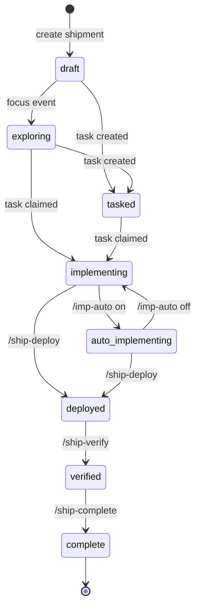

# Common Workflows

**Status**: Living document
**Last Updated**: 2026-02-08

This guide covers the standard patterns for working with ORC.

## Shipment Lifecycle

Shipments are the primary unit of work in ORC. They progress through a defined lifecycle:



### State Descriptions

| State | Description |
|-------|-------------|
| `draft` | Shipment created but not started |
| `exploring` | Active ideation/research phase |
| `tasked` | Tasks have been created |
| `implementing` | Manual implementation mode |
| `auto_implementing` | Autonomous implementation mode |
| `deployed` | Merged to main branch |
| `verified` | Post-deploy verification passed |
| `complete` | Terminal state |

### Auto-Transitions

Some transitions happen automatically:

| Event | Transition |
|-------|------------|
| Focus shipment | draft → exploring |
| Create first task | draft/exploring → tasked |
| Claim task | tasked → implementing |

## Creating Work

### Starting a New Shipment

```
/ship-new "Title of the work"
```

Creates a shipment and focuses it. Use for any piece of work you want to track.

### Quick Idea Capture

```
/orc-ideate
```

Rapid idea capture for brainstorming. Creates a focused shipment for quick exploration.

### Knowledge Synthesis

```
/ship-synthesize
```

When a shipment has accumulated exploration notes, use this to compact them into a summary note. Transforms messy exploration into structured knowledge.

### Planning Tasks

```
/ship-plan
```

C2/C3 engineering review that pressure-tests synthesized knowledge and creates tasks. Use when ready to convert exploration into actionable implementation.

## IMP Workflow

The IMP (Implementation agent) follows a structured workflow for each task:

### 1. Start Work

```
/imp-start        # Manual mode
/imp-start --auto # Auto mode (Stop hook blocks until complete)
```

Claims the first ready task and optionally enables autonomous mode.

### 2. Create Plan

```
/imp-plan-create
```

Research the codebase and create an implementation plan for the current task. The plan documents:
- What files to modify
- What changes to make
- Verification steps

### 3. Submit Plan

```
/imp-plan-submit
```

Submits and approves the plan. Plans are approved immediately since task specification happens upstream via `/ship-plan`.

### 4. Implement

Execute the plan:
- Make the code changes
- Run verification (tests, lint)
- Ensure all plan items are addressed

### 5. Create Receipt

```
/imp-rec
```

Verifies completed work, creates a receipt documenting the outcome, completes the task, and claims the next ready task.

## Operating Modes

### Manual Mode (implementing)

Default mode. IMP can stop at any time for human review or oversight.

```
/imp-auto off    # Switch to manual
```

### Auto Mode (auto_implementing)

Autonomous mode. Stop hook blocks until shipment is complete.

```
/imp-auto on     # Switch to auto
```

In auto mode, the IMP is propelled through the workflow:
1. No plan? → /imp-plan-create
2. Plan exists? → Implement it, then /imp-rec
3. Stuck? → /imp-escalate
4. Task complete? → /imp-rec chains to next

## Deployment

### Deploy Shipment

```
/ship-deploy
```

Merges the workbench branch to main. Only available when all tasks are complete.

### Verify Deployment

```
/ship-verify
```

Post-deploy verification. Confirms the deploy was successful.

### Complete Shipment

```
/ship-complete
```

Marks the shipment as complete after verification passes.

## Next Steps

- [docs/glue.md](glue.md) - Skills and hooks system
- [docs/troubleshooting.md](troubleshooting.md) - Common issues
- [docs/architecture.md](architecture.md) - System design
