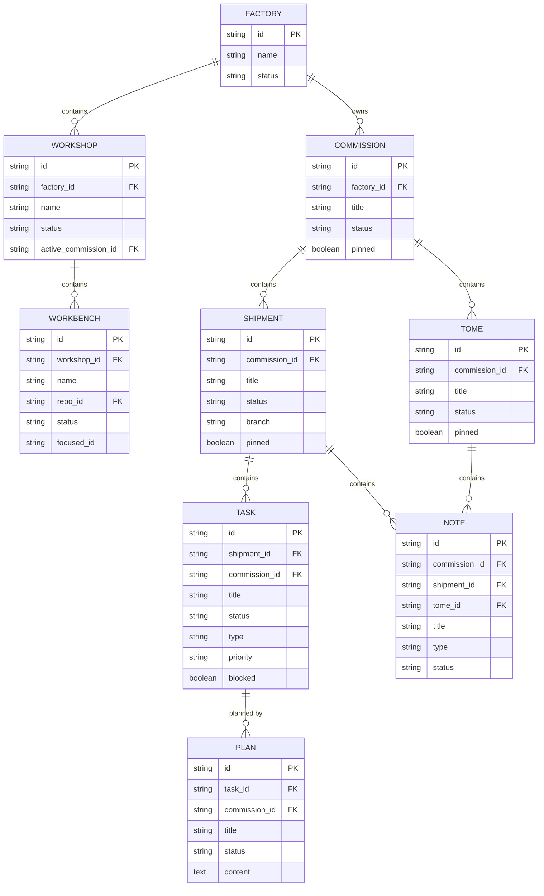

# ORC Database Schema

**Status**: Living document
**Last Updated**: 2026-02-08

This document contains the core entity-relationship diagram for ORC's database schema.

For the complete schema including messaging and auxiliary tables, see `internal/db/schema.sql`.

---

## Core Entity Relationships



---

## Table Descriptions

| Table | Purpose | Key Fields |
|-------|---------|------------|
| **factories** | TMux sessions / runtime environments | name, status |
| **workshops** | TMux sessions within a factory | factory_id, name, active_commission_id |
| **workbenches** | Git worktrees within a workshop | workshop_id, repo_id, focused_id |
| **commissions** | Top-level coordination scopes | factory_id, title, status |
| **shipments** | Work containers with lifecycle | commission_id, title, status, branch |
| **tasks** | Atomic units of work | shipment_id, title, status, type, priority, blocked |
| **tomes** | Knowledge containers | commission_id, title, status |
| **notes** | Observations, learnings, decisions | shipment_id, tome_id, title, type |
| **plans** | Implementation plans (1:many with task) | task_id, title, content, status |

---

## Hierarchy Summary

**Infrastructure:**
```
Factory → Workshop → Workbench
```

**Work Tracking:**
```
Commission → Shipment → Task → Plan
                     → Note
          → Tome → Note
```

---

## See Also

- `internal/db/schema.sql` - Complete schema
- `docs/reference/architecture.md` - System architecture overview
- `docs/reference/shipment-lifecycle.md` - Shipment state machine
