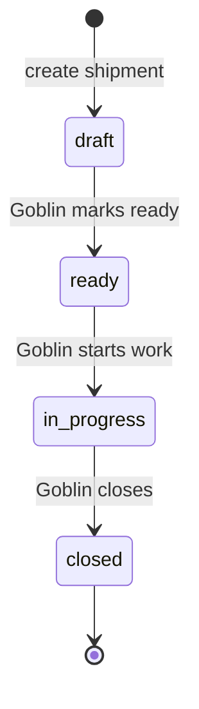
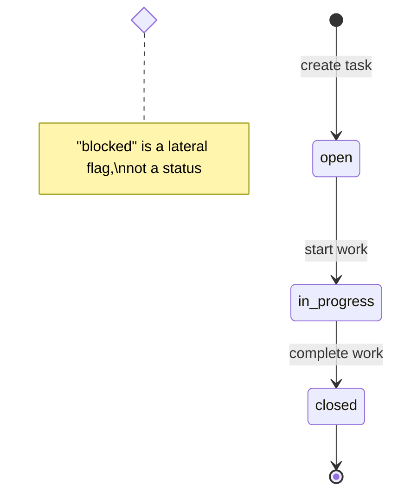

# Shipment & Task Lifecycles

**Status**: Living document
**Last Updated**: 2026-02-11

Shipments and tasks use simple, manual lifecycles. All transitions are decided by the Goblin (coordinator). There are no auto-transitions.

---

## Shipment Lifecycle

### State Diagram



### States

| State | Description | Next Step |
|-------|-------------|-----------|
| `draft` | Shipment created, not yet ready for work | Mark ready when scoped |
| `ready` | Scoped and ready for implementation | Start work |
| `in-progress` | Active implementation | Close when complete |
| `closed` | Terminal state | -- |

All transitions are manual. The Goblin decides when to advance.

---

## Task Lifecycle

### State Diagram



### States

| State | Description | Next Step |
|-------|-------------|-----------|
| `open` | Task created, available for work | Start work |
| `in-progress` | Actively being worked on | Close when done |
| `closed` | Terminal state | -- |

### Blocked (Lateral State)

`blocked` is a boolean flag, not a status. Any non-closed task can be marked blocked/unblocked independently of its lifecycle status.

```bash
orc task block TASK-xxx     # Mark as blocked
orc task unblock TASK-xxx   # Remove blocked flag
```

---

## See Also

- [docs/schema.md](schema.md) - Database schema with all valid states
- [internal/core/shipment/guards.go](../internal/core/shipment/guards.go) - Guard implementations
