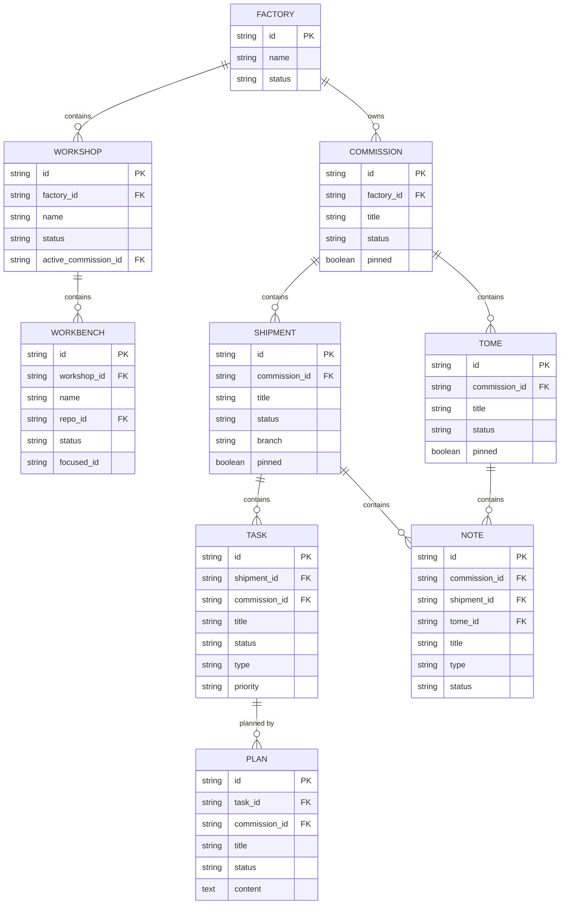

# ORC Schema & Glossary

**Status**: Living document
**Last Updated**: 2026-02-12

Core terminology and database schema for the ORC system. Terms are defined in the glossary; entity relationships and table details follow.

---

## Glossary

**📋 Commission**
A body of work being tracked. Top-level organizational unit. Contains shipments.

**👔 El Presidente**
The human. Strategic decision maker and boss. Commands the forest.

**🏭 Factory**
A collection of workshops, typically representing a codebase or project area.

**👺 Goblin**
Coordinator agent. The human's long-running workbench pane. Creates/manages ORC tasks with the human. Memory and policy layer (what and why).

**👹 IMP**
Disposable worker agent spawned by Claude Teams. Executes tasks using Teams primitives. Execution layer (how and who).

**📝 Note**
Captured thought within a shipment. Types: idea, question, finding, decision, concern, spec.

**📐 Plan**
C4-level implementation detail. Specifies files and functions to edit.

**📦 Shipment**
Unit of work with a 4-status lifecycle: draft, ready, in-progress, closed. Contains tasks and notes.

**✔️ Task**
Specific implementation work within a shipment. Lifecycle: open, in-progress, closed (+blocked lateral state).

**📖 Tome**
Knowledge container at commission level. Holds notes for long-running reference.

**🔧 Workbench**
Git worktree where agents work. Isolated development environment with dedicated tmux window.

**🛠️ Workshop**
Collection of workbenches for coordinated work.

---

## Core Entity Relationships



---

## Table Descriptions

| Table | Purpose | Key Fields |
|-------|---------|------------|
| **factories** | TMux sessions / runtime environments | name, status |
| **workshops** | TMux sessions within a factory | factory_id, name, active_commission_id |
| **workbenches** | Git worktrees within a workshop | workshop_id, repo_id, focused_id |
| **commissions** | Top-level coordination scopes | factory_id, title, status |
| **shipments** | Work containers with lifecycle | commission_id, title, status, branch |
| **tasks** | Atomic units of work | shipment_id, title, status, type, priority |
| **tomes** | Knowledge containers | commission_id, title, status |
| **notes** | Observations, learnings, decisions | shipment_id, tome_id, title, type |
| **plans** | Implementation plans (1:many with task) | task_id, title, content, status |

---

## Hierarchy Summary

**Infrastructure:**
```
Factory → Workshop → Workbench
```

**Work Tracking:**
```
Commission → Shipment → Task → Plan
                     → Note
          → Tome → Note
```

---

## See Also

- `internal/db/schema.sql` - Complete schema
- `docs/architecture.md` - System architecture overview
