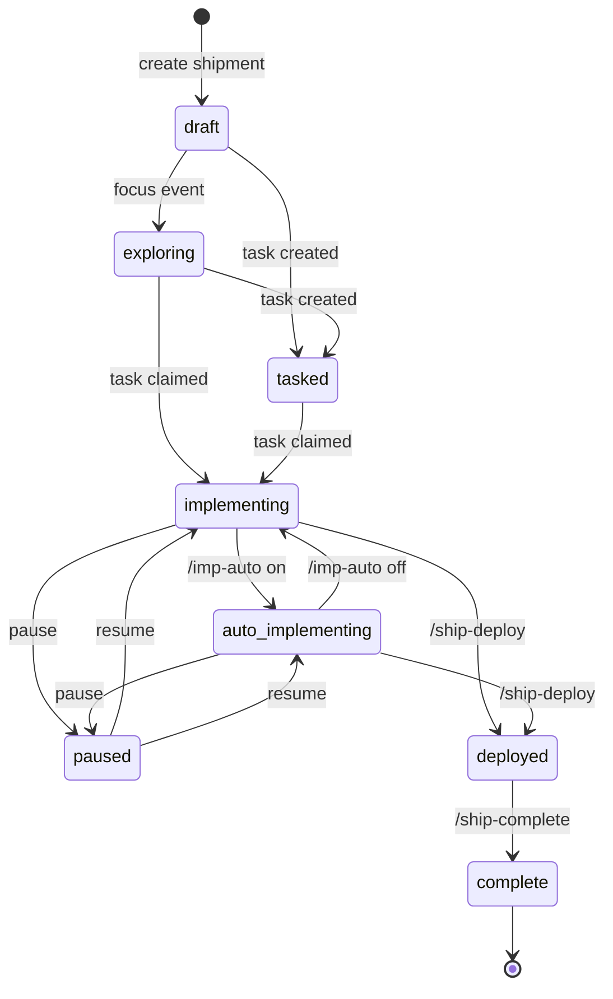

# Shipment Lifecycle

**Status**: Living document
**Last Updated**: 2026-02-08

This document contains the complete state machine for ORC shipments.

---

## State Diagram

---

## State Descriptions

| State | Description |
|-------|-------------|
| `draft` | Shipment created but not started |
| `exploring` | Active ideation/research phase |
| `tasked` | Tasks have been created |
| `implementing` | Manual implementation mode |
| `auto_implementing` | Autonomous implementation mode (Stop hook blocks) |
| `paused` | Implementation paused |
| `deployed` | Merged to main branch |
| `complete` | Terminal state - shipment finished |

---

## Transitions

### Manual Transitions

| From | To | Trigger | Command |
|------|-----|---------|---------|
| implementing | auto_implementing | Enable auto mode | `/imp-auto on` |
| auto_implementing | implementing | Disable auto mode | `/imp-auto off` |
| implementing | paused | Pause work | `orc shipment pause` |
| auto_implementing | paused | Pause work | `orc shipment pause` |
| paused | implementing | Resume work | `orc shipment resume` |
| implementing | deployed | Deploy to main | `/ship-deploy` |
| auto_implementing | deployed | Deploy to main | `/ship-deploy` |
| deployed | complete | Complete shipment | `/ship-complete` |

### Auto-Transitions

These transitions happen automatically based on events:

| Event | From | To |
|-------|------|-----|
| Focus shipment | draft | exploring |
| Create first task | draft, exploring | tasked |
| Claim task | tasked, exploring | implementing |

---

## Operating Modes

### Manual Mode (`implementing`)

Default mode. IMP can stop at any time for human review or oversight.

- Human controls the pace
- Can pause/resume freely
- Use for sensitive or complex work

### Auto Mode (`auto_implementing`)

Autonomous mode. Stop hook blocks until shipment is complete or paused.

- IMP is propelled through workflow automatically
- No plan? → `/imp-plan-create`
- Plan exists? → Implement it, then `/imp-rec`
- Stuck? → `/imp-escalate`
- Task complete? → `/imp-rec` chains to next

Toggle with `/imp-auto on` or `/imp-auto off`.

---

## See Also

- `docs/common-workflows.md` - IMP workflow documentation
- `docs/schema.md` - Database schema
- `internal/core/shipment/guards.go` - Guard implementations
